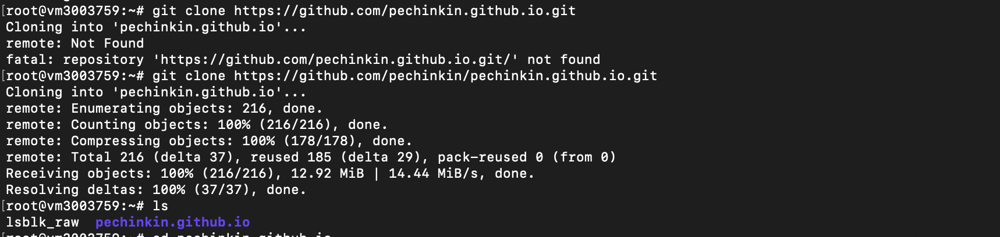
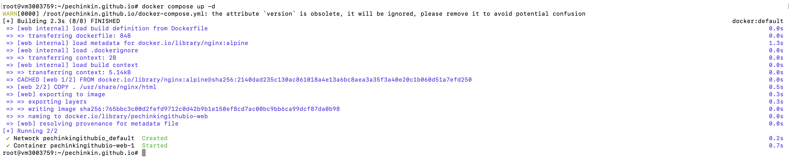
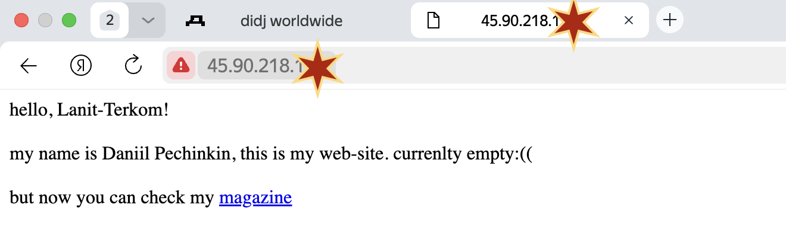
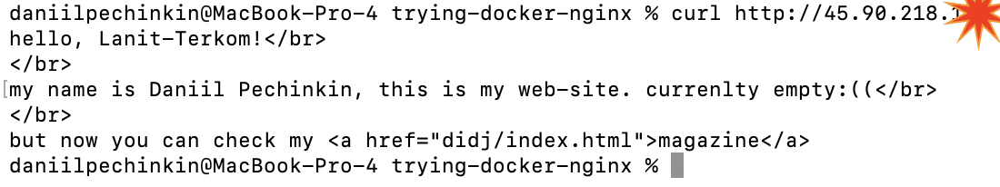

## Test task for Lanit-Terkom's project [devops]
The task is to clone a git repository, create a dockerfile + docker compose (including nginx) and run it. Also, i needed to redirect all ports to 80, where i will be running the container, but this part wasn't implemented due to my lack of knowledge and internet-silence about this question

Structure:
- [How to do it](#how-to-do-it-linux--macos)
- [Other bash commands i used](#other-bash-commands-i-used-while-working-on-this-task)
- [Screenshots](#screenshots)

##### How to do it (Linux / MacOs)

1. Check if git, docker and docker compose are installed (latest versions of docker engine includes docker compose in itself) by running ```git --version & docker --version```. If something isn't installed write ```sudo apt-get update & sudo apt-get intall git``` for git and for docker follow [their tutorial](https://docs.docker.com/engine/install/ubuntu/).
2. Clone your git repo by running ```git clone https://link-to-your-repo```* (in our case repo consists pages for web-site, you will see)
3. Add Dockerfile with code from Dockerfile in this repo:
https://github.com/pechinkin/trying-docker-nginx/Dockerfile
4. Add docker-compose.yml to your directory as well:
https://github.com/pechinkin/trying-docker-nginx/docker-compose.yml
5. Run container with ```docker compose up -d```
6. Check the connection by going to ```http://YOUR_VM_IP``` or by running ```curl http://YOUR_VM_IP``` in console.
7. If you want to finish running container, find its ID by running ```docker ps``` and ```docker stop YOUR_CONTAINER_ID```

*I cloned repository with my web-site: https://github.com/pechinkin/pechinkin.github.io

#### Other bash commands i used while working on this task
- `ssh username@vm_ip` to connect to VM. you need to know the password as well
- `cat ~/.bash_history ` to check if the bash commands is saved (it is an requirement for this task)
- `exit` to save commands in bash history (required by the task)
- `vim` to edit code faster than writing `echo` (but i used both haha)

#### Screenshots
Cloning git:


Docker compose:


Browser view:


Http request by `curl`:


That's all. It's ain't much, but it is honest work